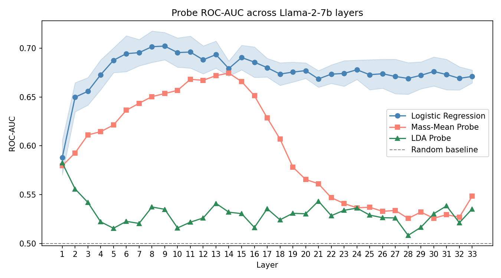
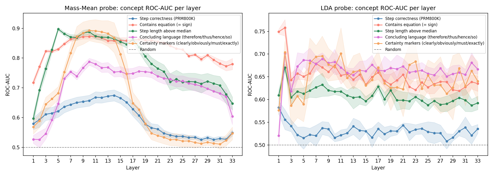
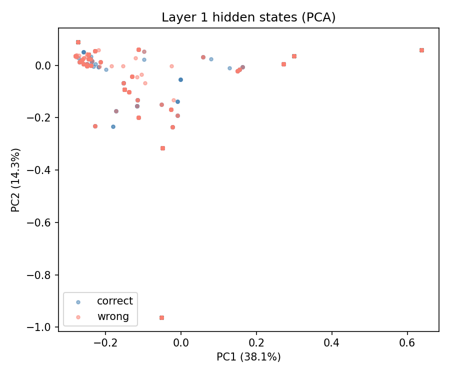
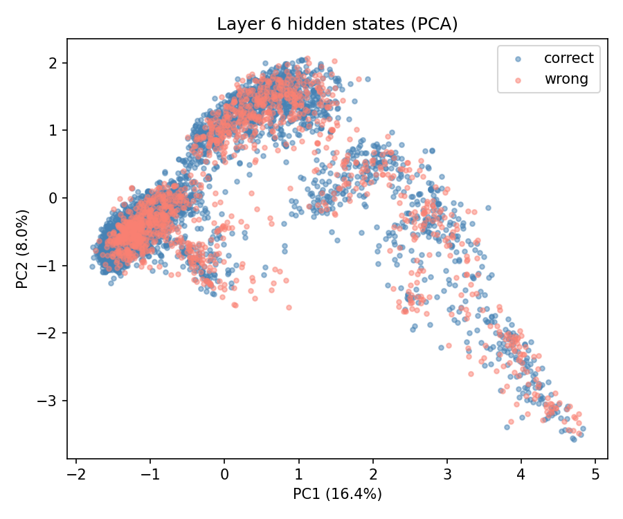
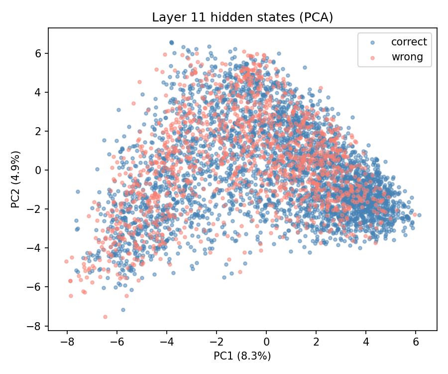
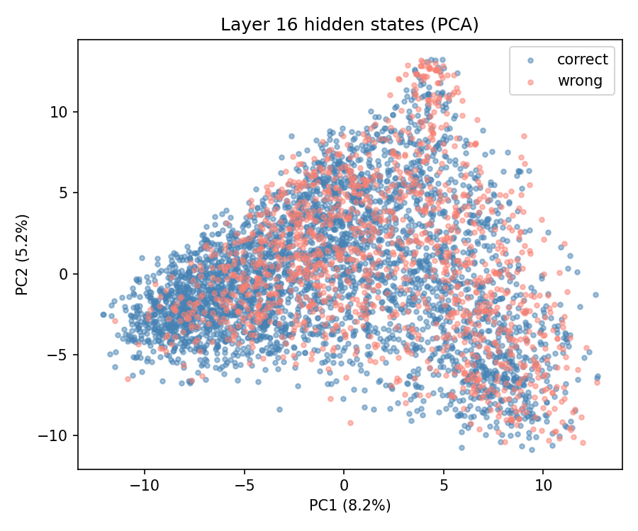
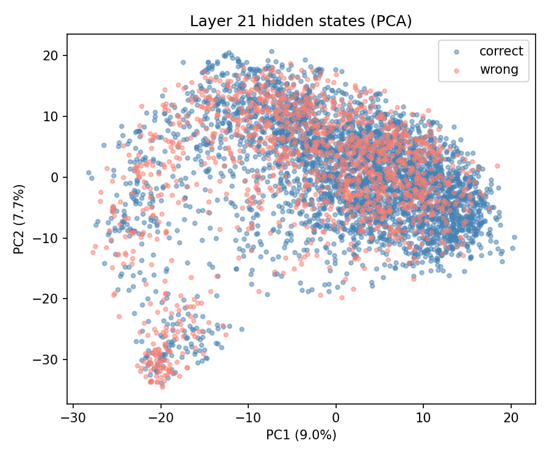
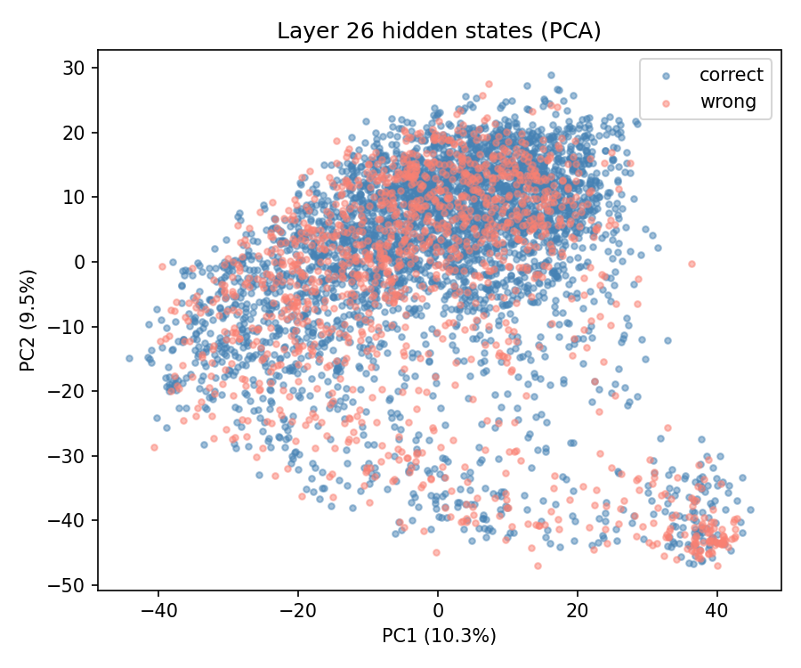
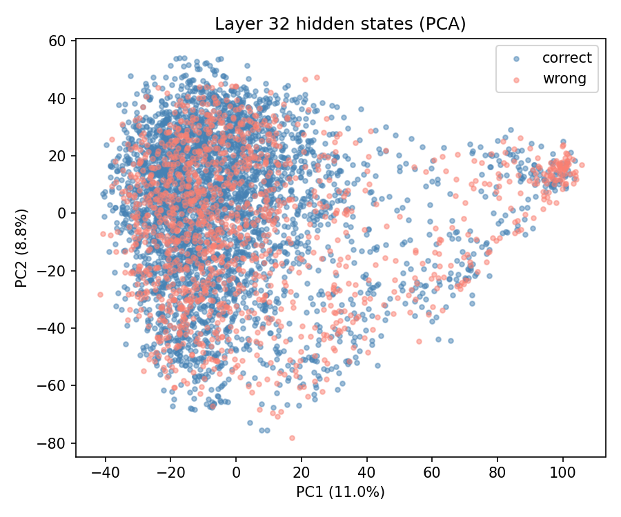

# Probing Reasoning in LLMs

Probes Llama-2-7b hidden states to detect correct vs. wrong reasoning steps using logistic regression, mass-mean probing, LDA, and INSIDE EigenScore on the PRM800K dataset.

## Project Structure

```
LingueTech/
├── config.py                  # paths, model name, hyperparameters, concepts
├── prepare_dataset.py         # PRM800K JSONL -> data/dataset.parquet
├── extract_hidden_states.py   # Llama-2-7b hidden states -> layers/layer{i}.csv
├── probing.py                 # logistic regression probing per layer
├── mass_mean_probe.py         # mass-mean and LDA probing (Geometry of Truth)
├── pca_viz.py                 # PCA scatter plots and ROC-AUC curve
├── eigenscore.py              # INSIDE EigenScore (hallucination detection)
├── run_kaggle.ipynb           # Kaggle orchestration notebook
└── requirements.txt
```

## Methods

**Logistic Regression Probing** — trains a linear classifier on each layer's last-token hidden state. Higher ROC-AUC in deeper layers indicates those layers encode step correctness more linearly.

**Mass-Mean Probing** (Marks & Tegmark, COLM 2024) — uses the difference of class centroids as the probe direction: `theta = mu_plus - mu_minus`. Compared with LDA (Fisher's Linear Discriminant). Run for 8 concepts including correctness, certainty, hedging, negation, and error acknowledgment.

**INSIDE EigenScore** (Chen et al. 2024) — generates N continuations per prompt, extracts hidden states, computes eigenvalue entropy of the cosine similarity matrix. Low entropy = consistent responses = model is confident = likely correct step.

## Running on Kaggle

Open `run_kaggle.ipynb` on Kaggle (GPU T4 recommended). The notebook:
1. Checks GPU availability
2. Installs dependencies
3. Reads your HuggingFace token from Kaggle Secrets (`HF_TOKEN`)
4. Clones this repo and downloads PRM800K via git lfs
5. Runs the full pipeline end-to-end

## Running locally (requires GPU + HF token)

```bash
pip install -r requirements.txt

# get PRM800K
git lfs install
git clone https://github.com/openai/prm800k.git
mkdir -p data
cp prm800k/prm800k/data/phase2_train.jsonl data/phase2_train.jsonl

# run pipeline
export HF_TOKEN=<your_token>
python prepare_dataset.py
python extract_hidden_states.py
python probing.py
python mass_mean_probe.py --all
python pca_viz.py
python eigenscore.py
```

## Concepts probed

| Concept | Description |
|---------|-------------|
| `label` | Step correctness (PRM800K ground truth) |
| `has_equation` | Contains `=` sign |
| `is_long_step` | Step length above median |
| `has_conclusion_word` | Concluding language (therefore/thus/hence/so) |
| `has_certainty` | Certainty markers (clearly/obviously/must/certainly) |
| `has_hedging` | Uncertainty markers (maybe/might/approximately/roughly) |
| `has_negation` | Negation present (not/no/never/neither) |
| `has_error_word` | Error acknowledgment (mistake/wrong/incorrect/invalid) |

## Results

### Logistic regression probing

| Metric | Value |
|--------|-------|
| Best layer | 9 |
| ROC-AUC | 0.702 |

The correctness signal is modest but consistent. The probe peaks around layers 8-10 and then gradually declines through the deeper layers, suggesting the model encodes step quality most cleanly at mid-depth.



The plot makes the method comparison stark. Logistic regression (blue) rises sharply to its peak by layer 2-3 and then stays nearly flat for the remaining 30 layers, meaning a linear classifier trained on any mid-to-deep layer performs about the same. Mass-mean (salmon) has a clear rise-and-fall shape, peaking at layer 13-14 and then collapsing toward random as the probe direction computed from class centroids loses its discriminative power in the final layers. LDA (green) is essentially at random (0.51-0.55) for the entire network when probing correctness, showing that covariance-corrected probing breaks down completely in this high-dimensional, limited-sample regime.

### Mass-mean probing across concepts

| Concept | Best layer | MM ROC-AUC | Note |
|---------|-----------|------------|------|
| `has_negation` | 9 | 0.918 | strongest signal overall |
| `is_long_step` | 5 | 0.897 | peaks earliest, surface-level feature |
| `has_certainty` | 10 | 0.893 | |
| `has_hedging` | 10 | 0.854 | |
| `has_equation` | 11 | 0.873 | |
| `has_conclusion_word` | 10 | 0.788 | |
| `label` (correctness) | 14 | 0.674 | hardest concept, peaks latest |
| `has_error_word` | 18 | 0.833* | *std=0.204, results unreliable |



The left panel shows a clear layered structure by concept type. Step length (green) shoots up earliest and steepest, reaching near-0.90 by layer 5 before any other concept has meaningful signal. Negation, certainty, and equations all form a tight band peaking at layers 9-11. Correctness (orange) is the flattest and lowest curve throughout, never catching up to any other concept even in its peak layers. The right panel (LDA) is largely uninterpretable: most concepts converge to a narrow band around 0.65-0.70 regardless of layer, and the within-run variance is high enough that the layer trends are not reliable.

Key findings:

**Correctness is the hardest concept.** Mass-mean AUC peaks at 0.674 on layer 14, lower than every other concept. Even logistic regression (0.702) beats it. This is expected: correctness is a reasoning-level judgment that requires understanding the full mathematical context, not just pattern-matching surface features.

**Surface features are encoded early.** Step length peaks at layer 5 (0.897). The model has already decided "this is a long step" well before it reasons about what the step says.

**Epistemic markers cluster at layers 9-11.** Negation (layer 9), certainty, hedging, and conclusion words (all layer 10), and equations (layer 11) reach peak separability within a tight window. This is where the model appears to encode "what kind of statement is this."

**Correctness peaks later than everything else** (layer 14 vs layers 5-11 for all other concepts). It requires more processing depth, consistent with the idea that evaluating reasoning correctness is a harder, higher-level task.

**LDA consistently underperforms mass-mean.** Across all concepts, the best LDA AUC is 0.50-0.76, well below mass-mean. With 4096-dimensional features and 5000 samples, the covariance estimate is noisy and LDA likely overfits. The simple centroid difference is more robust in this regime.

**Error word detection is noisy.** The concept is rare in the dataset (most steps do not contain explicit error acknowledgments), leading to class imbalance and high variance across runs. Results for this concept should not be interpreted without rebalancing.

### PCA of hidden states

| | | |
|---|---|---|
|  |  |  |
|  |  |  |
|  | | |

Layer 1 shows a very sparse, concentrated cloud with PC1 explaining 38.1% of variance. Almost all points sit in a tight cluster near the origin with a handful of outliers, and correct/wrong steps are already completely mixed. This is the raw embedding layer with little contextual processing.

By layer 6 the picture changes completely. The cloud is dense. The representations have spread across the space as the model builds contextual structure. The explained variance per component drops sharply (PC1=16.4%) because information is now distributed across many dimensions rather than concentrated in a few.

Layers 11-26 maintain this dense, spread structure with PC1 hovering around 8-10%. The clouds are roughly gaussian with elongated or fan shapes, and their specific geometry changes as the model processes information at different depths.

In no layer is there any visible separation between correct (blue) and wrong (salmon) steps along the principal axes. Correctness is not one of the main directions of variation in Llama-2's representational space. The probe does find a direction that separates the classes, but it is a low-variance direction that PCA does not surface. This explains why PCA visualization shows complete mixing while a linear probe still achieves 0.70 AUC: the signal exists but it is orthogonal to the dominant structure of the space.
